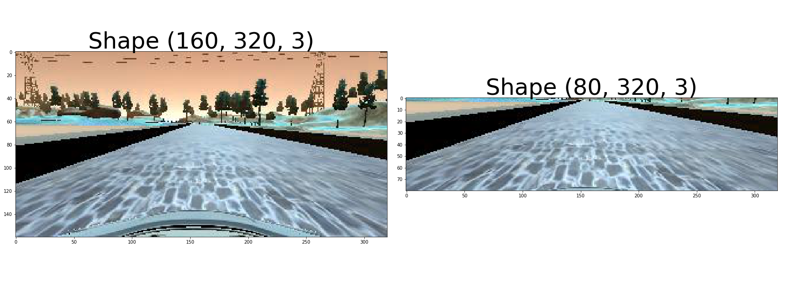

# Writeup Template--Behavioral Cloning P3

# *Rubric Points*
## All required files necessary run the simulator in autonomous mode are included.
The included files are:
* model.py containing the script to create and train the model
* drive.py for driving the car in autonomous mode
* model.h5 containing a trained convolution neural network 
* video.mp4 is a video illustrating a successful lap of the course in autonomous mode
* writeup_report.md summarizing the results

## *Model Architecture and Training Strategy*
### 1. Model architecture
Two models were constructed and evaluated.  The first model was based on the LeNet architecture and the second model was based on the NVIDA archetecture described in this NVIDA [blog post](https://devblogs.nvidia.com/parallelforall/deep-learning-self-driving-cars).  While it was demonstrated that it is possible to successfully train the LeNet model to safely steer the car around the track, this write up will focus on the application of the NVIDA architecture.

The NVIDA architecture consited of sequence of four 2D convolutions with RELU activations followed by a sequence of four dense layers with linear activations.  The network parameters (convolution kernals, strides and dense layer sizes) are illustrated in Figure 1 which was obtained from the NVIDA post.

Figure 1: Illustration of the NVIDA network used in this study.

Each image fed into the network was preprocessed as follows: the upper and lower edges of the image is cropped then the image is normalized.  The upper 60 pixels of the image were cropped to minimize the horizon background clutter while simulatneously providing a full view of the road as it vanished into the image horizon.  The low 20 pixels of the image were cropped out because the lower section of the image is dominate by a static view of the car hood.  Because of this, it was assumed that the lower 20 pixels would not contribute to the training justifying their removal. Figure 2 illustrates the pre- and post-cropping of the camera image.
Figure 2: Example of the pre and post cropped camera image.

The cropped image was then normalized as follows:
      normalized image = (cropped image)/255.0 - 0.5

Other forms of image manipulation such as histogram equalization or converstion to black and white could prove useful but were not explored.

### 2. Overfitting reduction
An early stopping callback was used to mitigate the possibility of overfitting the data. If the change in the validation loss was less than 0.001 between successive epochs, then the early stopping callback which terminated the fitting (training) of the model.  Figure 3 shows the training and validation loss as a function of epoch for the final trained case.
Figure 3: Loss as a function of epoch

Dropouts (with k=0.5) were placed between each of the convolution layers at the output of the last convolution layer in an effort to prevent overtraining.  However for each test where dropouts were used the car steering was worse.  Hence, no dropout layers were used in the final model.

### 3. Model parameter tuning
The model used an Adam optimizer.  In addition, the default Adam optimizer parmaters (lr=0.001, beta_1=0.9, beta_2=0.999, epsilon=1e-08, decay=0.0) were used in this study.

### 4. Training data
Eight datasets of training simulations were generated.  Each dataset was stored in a serperate directory, which allowed for varying the quantity and quality of the training data to evaluate which combination of data yields a trained model that can successfully navigate the course in autonomous mode.  The eight datasets are:
1. One full lap around course one with the car traveling along the center of the road,
1. Two full laps around course one with the car traveling along the center of the road followed by two full laps with the car traveling in the opposit direction.
1. A partial lap around course two.
1. Two full laps around course one with the car traveling along the center of the road followed by two full laps with the car traveling in the opposit direction.
1. Two full laps around course one with the car zigzagging from left to right followed by two full laps with the car traveling in the opposit direction and zigzaggin.
1. Two full laps around course one with the car traveling along the center of the road followed by two full laps with the car traveling in the opposit direction.
1. Two passes by the dirt areas of course with the car traveling in the forward and opposite directions.
1. One full laps around course one with the car traveling along the center of the road followed by one full laps with the car traveling in the opposit direction.

Three camera images (center, left and right) were recorded as the car traveled the course.  In addition to the camera images, the steering angle was simultaneously recorded.  Note: the steering angles for the left and right cameras were corrected due to the fact that the cameras were angled away from the direction of travel of the car.  An analysis of the left, right and center camera images suggeted that the left and right cameras were angled by +0.1 and -0.1 radians from the center, respectivley.

The training data was further augmented by mirroring each camera around it's vertical (y) axis.  The steering angle for each mirrored image was taken to be the negitive of the steering angle of the non-flipped image.

This augmented data (three cameras plus mirroring) was used as the training input.

## Model Architecture and Training Strategy
## 1. Solution Design Approach
The overall strategy for deriving a model architecture was to first consider a LeNet architecture followed by the NVIDA architecture.  The primary difference between the two architectures was 1) an additional convolutional layer with NVIDA and 2) the additional of maxpooling layers in the LeNet.  The next step was to systematically combine the training datasets until a combination of training sets was obtained that would yield a trained network that could successfully navigate the car around course one in autonomous mode.

The best combination of driving datasets was set 1, 4 and 6.  The combination of these training datasets provided a total of 5 laps around course 1 in the forward direction and 4 laps in the reverse direction.  The addition of a zigzag path or just passing the dirt section did not improve the performance of the trained network.

It was possible to successfully train both the LeNet and the NVIDA models to autonomously drive the car around course one.  However, it was subjectively determined that the NVIDA model was superior to the LeNet model (faster processing and better steering control).  Therefore, the results of the NVIDA model were submitted for review.

The driving data sets were split into a training set and a validation set using and 80/20 split.  The training set was used for the model fitting while the validation set was used for evaluation of overfitting.  Specifically a early stoppint callback was employed to prevent overfitting (see "Overfitting reduction" for more details).

At the end of the process, the vehicle is able to drive autonomously around the track without leaving the road.

### 2. Final Model Architecture
See Figure 1 for illustration of the final model architecture.

### 3. Creation of the Training Set & Training Process

The best combination of driving datasets was set 1, 4 and 6.  The combination of these training datasets provided a total of 5 laps around course 1 in the forward direction and 4 laps in the reverse direction.  The addition of a zigzag path or just passing the dirt section did not improve the performance of the trained network.

## Simulation
Video.mp4 is a video showing the car successfully navigating course 1.
